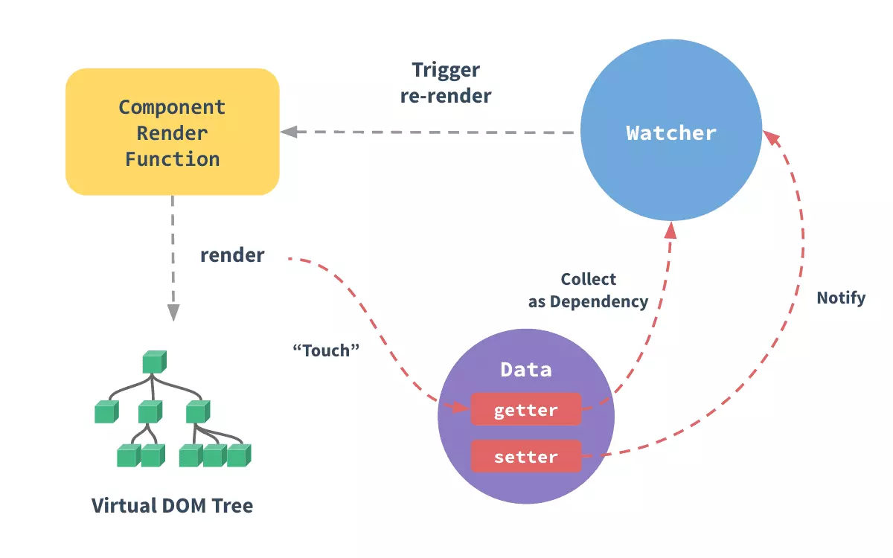

# 一.编码优化
## data属性  



视图渲染中不必要的数据不可放在data中，data中的数据都会增加getter和setter，会收集对应的watcher。data数据过多，会影响性能。

### 源码

```javascript
export function defineReactive (
  obj: Object,
  key: string,
  val: any,
  customSetter?: ?Function,
  shallow?: boolean
) {
  const dep = new Dep()
  let childOb = !shallow && observe(val)
  Object.defineProperty(obj, key, {
    get: function reactiveGetter () {
      const value = getter ? getter.call(obj) : val
      if (Dep.target) {
        dep.depend() // 收集依赖
        if (childOb) {
          childOb.dep.depend()
          if (Array.isArray(value)) {
            dependArray(value)
          }
        }
      }
      return value
    },
    set: function reactiveSetter (newVal) {
      const value = getter ? getter.call(obj) : val
      if (setter) {
        setter.call(obj, newVal)
      } else {
        val = newVal
      }
      childOb = !shallow && observe(newVal)
      dep.notify() // 执行watcher的update
    }
  })
}
```

## keep-alive缓存组件
keep-alive可以实现组件的缓存功能，缓存当前组件的实例，及组件的状态。

### 实例
```javascript
<!-- 失活的组件将会被缓存！-->
<keep-alive>
  <component v-bind:is="currentTabComponent"></component>
</keep-alive>
```

### 源码
```javascript
render () {
    const slot = this.$slots.default // 获取默认插槽
    const vnode: VNode = getFirstComponentChild(slot)
    const componentOptions: ?VNodeComponentOptions = vnode && vnode.componentOptions
    if (componentOptions) {
      // check pattern
      const name: ?string = getComponentName(componentOptions)
      const { include, exclude } = this
      if ( // 匹配 include / exclude
        // not included
        (include && (!name || !matches(include, name))) ||
        // excluded
        (exclude && name && matches(exclude, name))
      ) {
        return vnode
      }

      const { cache, keys } = this
      const key: ?string = vnode.key == null
        // same constructor may get registered as different local components
        // so cid alone is not enough (#3269)
        ? componentOptions.Ctor.cid + (componentOptions.tag ? `::${componentOptions.tag}` : '')
        : vnode.key
      if (cache[key]) { // 如果有缓存 直接将缓存返回
        vnode.componentInstance = cache[key].componentInstance
        // make current key freshest
        remove(keys, key)
        keys.push(key)
      } else {
        cache[key] = vnode // 缓存下来下次用
        keys.push(key)
        // 超过缓存限制 就删除
        if (this.max && keys.length > parseInt(this.max)) {
          pruneCacheEntry(cache, keys[0], keys, this._vnode)
        }
      }

      vnode.data.keepAlive = true
    }
    return vnode || (slot && slot[0])
  }
```
  
## 拆分组件 
  - 提高复用性、增加代码的可维护性
  - 减少不必要的渲染 (尽可能细化拆分组件)

## v-if 
`v-if`是`真正` 的条件渲染，因为它会确保在切换过程中条件块内的事件监听器和子组件适当地被销毁和重建；当值为`false`时条件块不渲染, 具有阻断功能，很多情况下使用v-if替代v-show。

`v-show`不管初始条件是什么，元素总会被渲染，并且只是简单的给予CSS的display属性进行切换。

## key保证唯一性 
- 默认vue会采用就地复用策略
- 如果数据项的顺序被改变，Vue不会移动DOM元素来匹配数据项的顺序
- 应该用数据的id作为key属性，确保数据的唯一性

## Object.freeze
vue会实现数据劫持，给每个属性增加getter和setter，可以使用freeze冻结数据。

```javascript
export default {
  data: () => ({
    users: {}
  }),
  async created() {
    const users = await axios.get("/api/users");
    this.users = Object.freeze(users);
  }
}
```
在数据劫持时属性不能被配置，不会重新定义

```javascript
const property = Object.getOwnPropertyDescriptor(obj, key)
if (property && property.configurable === false) {
return
}
```

## 路由懒加载、异步组件
动态加载组件，依赖webpack-codespliting功能
```javascript
const router = new VueRouter({
  routes: [
    { path: '/foo', component: () => import(/* webpackChunkName: "group-foo" */ './Foo.vue') }
    { path: '/bar', component: () => import(/* webpackChunkName: "group-foo" */ './Bar.vue') }
  ]
})
```
动态导入组件
```javascript
import Dialog from "./Dialog";
export default {
  components: {
    Dialog: () => import("./Dialog")
  }
};
```
## runtime运行时
使用VUE开发项目，尽量采取`runtime`构建版本，运行时版本相比完整版体积要小大约 30%，并且包含编译器会对使用VUE`template`属性的代码在客户端进行运行时编译，相对影响性能。
因此建议使用`runtime`构建版本，在开发时尽量采用单文件的方式。

```javascript
// 需要编译器
new Vue({
  template: '<div>{{ hi }}</div>'
})

// 不需要编译器
new Vue({
  render (h) {
    return h('div', this.hi)
  }
})
```

## 数据持久化的问题 
- 通过将数据存放在`cookie`、`localStorage`、`sessionStorage中`，减少不必要的接口重复请求，并保证数据持久化存储, 也可以使用`vuex-persistedstate`插件，实现自动化数据存储。

- 采用防抖、节流操作

::: warning COMPATIBILITY NOTE
因为`localstorage`、`sessionstorage`的写入是同步的，因此存在不小的性能开销，使用`localstorage`、`sessionstorage`时要注意：
- 多次写入操作合并为一次，比如采用函数节流或者将数据先缓存在内存中，最后在一并写入
- 只有在必要的时候才写入
:::

##  事件销毁
VUE组件销毁时，会自动清理它与其他实例的连接，解绑它的全部指令及事件监听器，但仅限于组件本身的事件。如果在js内使用`addEventListener`等方式是不会自动销毁的，因此需要在组件销毁时移除事件监听，以免内存泄漏。

```javascript
created() {
  addEventListener('click', this.click, false)
},
beforeDestroy() {
  removeEventListener('click', this.click, false)
}
```
