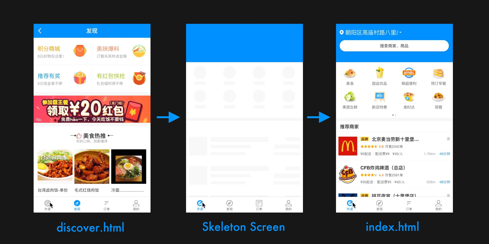

# 三.用户体验
## Skeleton Screen骨架屏

Skeleton Screen(骨架屏)就是在页面数据尚未加载前先给用户展示出页面的大致结构，直到请求数据返回后再渲染页面，补充进需要显示的数据内容。

为了减少白屏时间，在页面完全渲染完成之前提升用户感知体验，可以通过插件[vue-skeleton-webpack-plugin](https://github.com/lavas-project/vue-skeleton-webpack-plugin)为单页/多页应用生成骨架屏`skeleton`来优化用户体验。

目前已有很多大厂如饿了么、小米等采用骨架屏的方式来优化用户体验，饿了么首页骨架屏的效果如下图所示：



>   VUE骨架屏的原理是: 在构建时，采用VUE预渲染功能，将骨架屏组件的渲染结果HTML片段插入HTML页面模板的挂载节点中，将样式内联到head标签中，这样等前端渲染完毕之后，VUE将使用客户端混合，把挂载节点中的骨架屏内容替换为真正的页面内容。

我们可以为项目MPA(多页面应用)配置骨架屏，同样也可为SPA(单页面应用)的多路由配置骨架屏，具体方法可参考官方文档。

以在`vue-cli3`中使用骨架屏为例，具体做法如下：

-  1. 在vue.config.js中引入插件，并初始化配置
```javascript
const path = require('path');
const SkeletonWebpackPlugin = require('vue-skeleton-webpack-plugin')
module.exports = {
    configureWebpack: (config) => {
        config.plugins.push(new SkeletonWebpackPlugin({
            webpackConfig: {
                entry: {
                    app: path.join(__dirname, './src/skeleton/skeleton.js')
                }
            },
            // SPA 下是压缩注入 HTML 的 JS 代码
            minimize: true,
            // 服务端渲染时是否需要输出信息到控制台
            quiet: true,
            // 根据路由显示骨架屏
            router: {
                    mode: 'history',
                    routes: [
                        {
                            path: '/',
                            skeletonId: 'skeleton-home'
                        },
                        {
                            path: '/message',
                            skeletonId: 'skeleton-message'
                        }
                    ]
            }
        }
    },
    css: {
        // 使用 css 分离插件 mini-css-extract-plugin，不然骨架屏组件里的 <style> 不起作用，
        extract: true,
    }
}
```

-  2. 创建skeleton入口文件
```javascript
// src/skeleton/skeleton.js
import Vue from 'vue'

// 引入的骨架屏组件
import skeletonHome from './skeleton/skeletonHome.vue'
import skeletonMessage from './skeleton/skeletonMessage.vue'

export default new Vue({
    components: {
        skeletonHome,
        skeletonMessage,
    },
    template: `
        <div>
            <skeletonHome id="skeleton-home" style="display:none"/>
            <skeletonMessage id="skeleton-message" style="display:none"/>
        </div>
    `
})
```

-  3. 创建skeleton组件，贴上其中一个骨架屏组件的代码:
```javascript
<template>
  <div class="skeleton-wrapper">
    <section>骨架屏-skeletonMessage</section>
  </div>
</template>

<script>
export default {
  name: 'skeletonMessage',
}
</script>
```

## 骨架屏Loading插件


